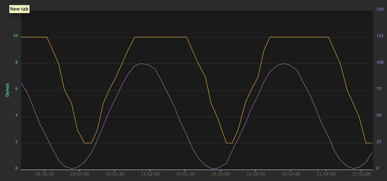

# Dynosaur

An auto-scaling engine for Heroku web dynos using pluggable API connections.
The first API is Google Analytics Live, which uses the number of active users
on the site to decide how many dynos to run. There is also a New Relic plugin
that uses the requests per minute.

## Methodology

Each plugin generates a 'value' at some set interval (e.g. polls the GA API
every 10s) and provides a conversion from the value ('active users on the site')
to estimated dynos required. (e.g. 100 active users per dyno). By default this
has some built in hysteresis, i.e.  the plugins are conservative about
decreasing their estimate and report the highest estimate of the past `N`
seconds.

Dynosaur takes the maximum of all plugin estimates, applies a global min/max
constraint and scales your Heroku app to match.

For example, see this plot of a dummy 'Sine wave' plugin (purple line) and the
resulting estimated dynos (orange line).

The plugin estimates 'units' per dyno,
and Dynosaur is configured with a minimum of 2 dynos. You can see that the
estimated dynos rapidly tracks the upward slopes, but trails the downward slope
by about 30s.

## Installation and Usage

See below about how to deploy to Heroku.

    $ gem install dynosaur

Create a YAML config file (see `config.sample.yaml` and info below) and run with:

    $ dynosaur config.yaml

## Global Autoscaler Configuration

The 'scaler' section of the config file configures the main parameters of the
autoscaler.

 - `heroku_app_name` (string): The name of the heroku app you want to autoscale
 - `heroku_api_key` (string): Heroku API key can be retrieved from [the Heroku account settings page.](https://dashboard.heroku.com/account)
 - `dry_run` (boolean): If enabled, the scaler does not actually change anything in Heroku, just
        simulates the values it would choose.
 - `interval` (int): The autoscaler sleeps for this many seconds before checking for
        activity. Note that each plugin is configured with an API polling
        interval too, so this does not increase the frequency of API polling.

Dynosaur will run indefinitely, with info output to stdout at intervals.

If multiple plugins are configured, the scaler will use the maximum of all
plugins results (i.e. if your New Relic plugin returns 3 dynos, and your GA plugin
returns 5, you should scale to 5 dynos.

## Statistics

Dynosaur can optionally use report statistics either to the command line or to
[Librato](http://librato.com).

The following stats are sent every *interval* seconds.

 - combined estimate of dynos required (includes min/max constraints)
 - Actual number we are using (includes hysteresis)

For each plugin we send

 - value (e.g. 'active users')
 - plugin dyno estimate

## Plugin Configuration

Dynosaur can scale different layers of your app, each layer is documented separately:

- [Web dynos](doc/dyno_controller.md) (based on Google Analytics Live API and/or NewRelic RPM data)
- [RedisCloud addon](doc/redis_controller.md) (based on number of connections and/or memory usage)
- [Papertrail addon](doc/papertrail_controller.md) (based on amount of log data generated per month)

### Common Plugin Configuration
All input plugins have the following config values

- `name` : unique identifier for the plugin instance. Freeform.
- `type` : the name of the plugin class e.g. `Dynosaur::Inputs::GoogleAnalyticsPlugin`
- `interval` (default 60s) : how often to poll the respective API. (i.e. the retrieved value
  is cached for 'interval' seconds.)
- `hysteresis_period` (default 300s) : the current estimate is based on the
  maximum value observed within this interval. i.e. If the maximum value of
  active users observed in the last 5 minutes is 127, we will base our estimate
  on 127 active users.

## Statistics Plugins

### Librato Stats Reporter Configuration

You can sign up for a free account

 - `type: Dynosaur::Stats::Librato`
 - `api_email` (string): Email of Librato account user.
 - `api_key` (string): API key.

### Console Stats Reporter Configuration

 - `type: Dynosaur::Stats::Console`

## Error Reporting Plugins

We've added pluggable error handling, with three implementations available so far

### Console (Default)

Logs errors to the console. No config.

### Bugsnag

Send exceptions to [Bugsnag](https://bugsnag.com). Configured like this in
  config.yaml:

    error_handlers:
        -
        type: Dynosaur::ErrorHandler::Bugsnag
        api_key: <%= ENV['BUGSNAG_API_KEY'] %>

### Email via AWS Simple Email Service

Configured like this in config.yaml

    error_handlers:
        -
        type: Dynosaur::ErrorHandler::Ses
        from: you@example.com
        to: you@example.com
        aws_access_key_id: <%= ENV['AWS_ACCESS_KEY_ID'] %>
        aws_secret_access_key: <%= ENV['AWS_SECRET_ACCESS_KEY'] %>

Warning: this has the tendency to send a lot of email due to minor blips in API
reliability.

## Success Plugins

We have included a pinger for our "dead man's switch" server [Cronut](https://github.com/harrystech/cronut). It will ping every minute or so, and we get an alert when Cronut hasn't received a ping for 10 minutes.

## Deploying Dynosaur to Heroku

At Harry's, we run Dynosaur as a Heroku app. Here's the steps to get it deployed:

1. Create heroku app.
2. Clone heroku git repository.
3. Create a Gemfile and add dynosaur as a gem (see `doc/Gemfile`).
4. Write your config file (see `doc/config.sample.yaml`)
  1. We use environment variables for secrets, so set them locally and in Heroku
5. Check that it works
   1. `bundle install`
   2. `bundle exec dynosaur config.yaml`
5. Copy the Procfile (from `doc/Procfile`) to the root of your project.
6. Commit it all and deploy to heroku

## Contributing

1. Fork it
2. Create your feature branch (`git checkout -b my-new-feature`)
3. Commit your changes (`git commit -am 'Add some feature'`)
4. Push to the branch (`git push origin my-new-feature`)
5. Create new Pull Request

## Writing a Plugin

You'll need to implement the following methods:

`retrieve()`: connect to an API (or wherever) and retrieve a new value. This is
wrapped in a caching layer by the plugin base class.

`value_to_dynos()`: calculate the estimated number of dynos based on the recent
maximum value returned by `retrieve()` (e.g. we use `users_per_dyno` in the GA
plugin). For more fine-grained control, you can override `estimate_dynos()`
instead.

`initialize(config)`: You can pull any configuration you require from the config hash passed in.

See the Google Analytics plugin or the toy Random plugin for an example.

## Contributors

* New Relic plugin by [Jan Lindblom](https://github.com/janlindblom/dynosaur)

